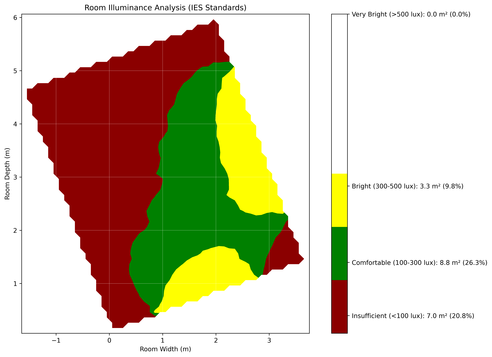
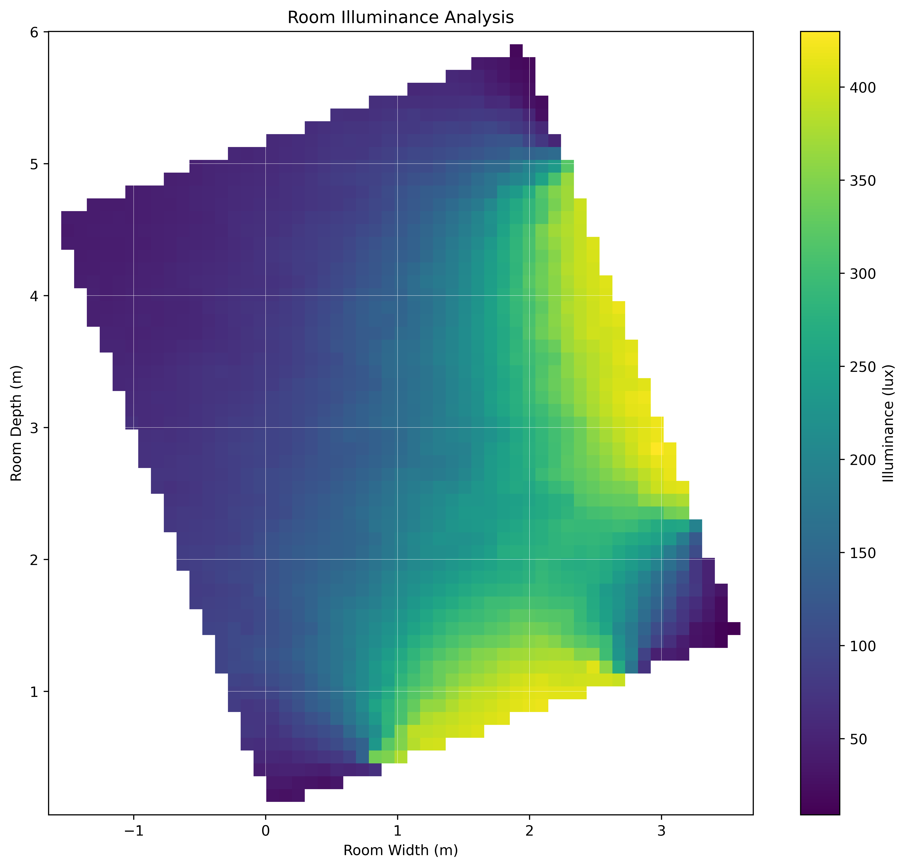

# Parametric daylighting study





Quick script to run daylighting analysis for a parametric study. 
Created for "Scientific Working" class in winter term 2024/25  Dep. Arch. RWTH Aachen university.

Very rough and basic needs much more work.

## Description

This project uses Ladybug Tools to perform parametric daylighting analysis. Ladybug Tools is an open-source environmental design plugin that helps architects and engineers design more sustainable buildings.

## Installation

### Prerequisites
- Anaconda or Miniconda
- Python 3.7 or higher
- Git

### Setup using Conda (Windows)

1. Create and activate a new conda environment:

```bash
conda create -n ladybug-env python=3.11
```


```bash
conda activate ladybug-env
pip install -r requirements.txt
pip install lbt-ladybug
pip install ladybug-rhino
```

## Running
```bash
python room_illumination_and_grids.py
````
## TODO
- make multithreaded... 
- improve parametrics and boundary checks in try / catch
